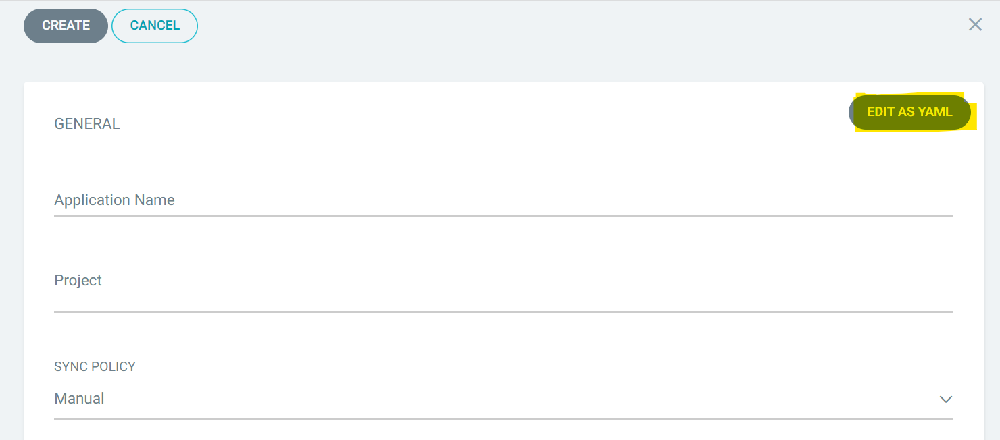
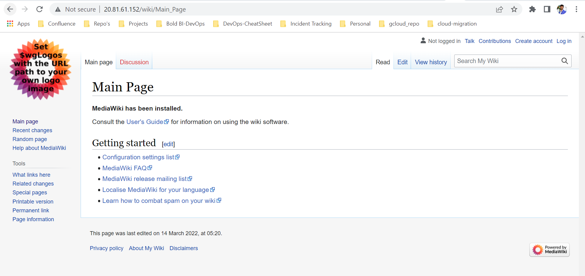

# Mediawiki deployment in Kubernetes with Argo CD

## Deployment prerequisites

1. AKS cluster
2. Azure storage account
3. Nginx ingress controller
4. Deploy [Argo CD](https://argo-cd.readthedocs.io/en/stable/getting_started/) in your cluster.

## Nginx Ingress controller

1. Connect with your Microsoft AKS cluster.

2. After connecting with your cluster, deploy the latest Nginx ingress controller to your cluster using the following command.

```sh
kubectl apply -f https://raw.githubusercontent.com/kubernetes/ingress-nginx/controller-v0.41.2/deploy/static/provider/cloud/deploy.yaml
```

## AKS File Storage

1. Create a File share instance in your storage account and note the File share name to store the shared folders for application usage.

2. Encode the storage account name and storage key in `base64` format.

For encoding the values to base64 please run the following command in powershell

```console
[System.Convert]::ToBase64String([System.Text.Encoding]::UTF8.GetBytes("<plain-text>"))
```
3. Edit the `pvclaim.yaml` inside the manifests folder and replace the **base64 encoded storage account name**, **base64 encoded storage account key**, and **File share name** noted in above steps to `<base64_azurestorageaccountname>`, `<base64_azurestorageaccountkey>`, and `<file_share_name>` places in the file respectively. You can also change the storage size in the YAML file.

## Deploying Mediawiki

1. If you have a DNS to map with the application, then you can continue with the following steps, else skip to **Step 5**.

2. Edit the **ingress.yaml** file. Uncomment the host value and replace your DNS hostname with `example.com` and save the file.

3. If you have the SSL certificate for your DNS and need to configure the site with your SSL certificate, follow the below step or you can skip to **Step 5**.

4. Run the following command to create a TLS secret with your SSL certificate.

```sh
kubectl create secret tls mediawiki-tls -n mediawiki --key <key-path> --cert <certificate-path>
```

5. Now, uncomment the `tls` section and replace your DNS hostname with `example.com` in ingress spec and save the file.

6. Edit the `mediawiki_deployment.yaml` replace your DNS or ingress IP address in `<Host domain or IP>` place.

7. Create a namespace in your cluster for Mediawiki deployment.

```sh
kubectl create namespace mediawiki
```

8. Run the following command to apply the pvclaim.yaml

```sh
kubectl apply -f pvclaim_aks.yaml
```

> **Note:** You can also modify the mariadb and mediawiki credentials in [kustomization.yaml](manifests/kustomization.yaml) in the `secretGenerator` section

9. Open Argo CD in your browser and create a new application. You can find the argocd application manifest in the root of this repository.



10. Copy and paste the yaml content from [argocd_application.yaml](argocd_application.yaml)

11. Click on Create to deploy the application.

12. You can now access Mediawiki with your DNS or Ingress IP address.

